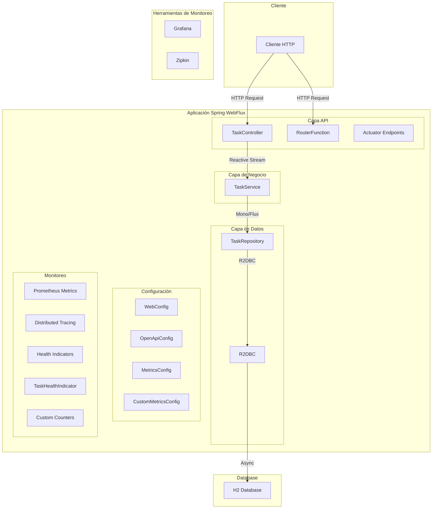
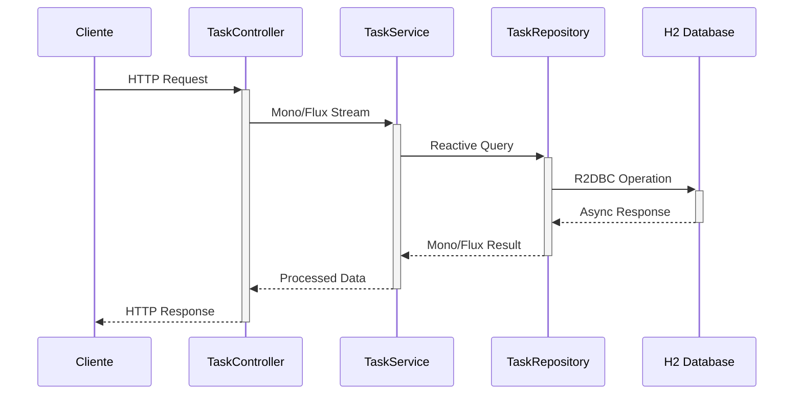
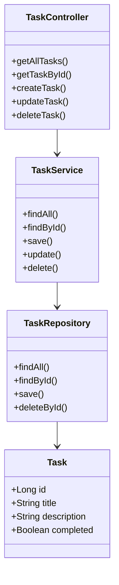

# Spring WebFlux Task Management Application

[](https://github.com/YamiCueto/webflux-project)

## Autor

**Yamid Cueto**
- GitHub: [@YamiCueto](https://github.com/YamiCueto)


Esta es una aplicación reactiva construida con Spring WebFlux para la gestión de tareas, utilizando una base de datos H2 con R2DBC para operaciones reactivas de base de datos.

## Requisitos Previos

- Java 17 o superior
- Gradle 8.5 o superior

## Tecnologías Utilizadas

- Spring Boot 3.1.5
- Spring WebFlux
- Spring Data R2DBC
- H2 Database
- Project Reactor
- SpringDoc OpenAPI (Swagger)
- Lombok

## Configuración del Proyecto

1. Clona el repositorio:
   ```bash
   git clone https://github.com/YamiCueto/webflux-project.git
   cd webflux-project
   ```

2. Compila el proyecto:
   ```bash
   ./gradlew build
   ```

## Ejecutar la Aplicación

1. Inicia la aplicación:
   ```bash
   ./gradlew bootRun
   ```

2. La aplicación estará disponible en:
   - API Principal: http://localhost:8080
   - Documentación API (Swagger): http://localhost:8080/swagger-ui.html
   - Consola H2: http://localhost:8080/h2-console

## Endpoints de la API

La API proporciona los siguientes endpoints para la gestión de tareas:

### Tasks

- `GET /api/tasks` - Obtener todas las tareas
- `GET /api/tasks/{id}` - Obtener una tarea por ID
- `POST /api/tasks` - Crear una nueva tarea
- `PUT /api/tasks/{id}` - Actualizar una tarea existente
- `DELETE /api/tasks/{id}` - Eliminar una tarea

## Base de Datos

La aplicación utiliza H2 como base de datos en memoria. La configuración de la base de datos se encuentra en `application.properties` y el esquema inicial en `schema.sql`.

## Documentación de la API

La documentación detallada de la API está disponible a través de Swagger UI. Para acceder:

1. Inicia la aplicación
2. Visita http://localhost:8080/swagger-ui.html

## Arquitectura y Flujo de Datos

### Diagrama de Componentes



### Flujo de Datos Reactivo



### Estructura de Componentes



## Desarrollo

Para desarrollar nuevas características:

1. La estructura del proyecto sigue el patrón de arquitectura en capas:
   - `controller` - Endpoints de la API
   - `service` - Lógica de negocio
   - `repository` - Acceso a datos
   - `model` - Entidades y DTOs
   - `config` - Configuraciones de Spring

2. Todas las operaciones son reactivas, utilizando tipos `Flux` y `Mono` de Project Reactor.

## Monitoreo y Observabilidad

La aplicación incluye varias herramientas para monitoreo y observabilidad:

### Actuator Endpoints

Accede a los endpoints de Spring Boot Actuator en:
- Health Check: http://localhost:8080/actuator/health
- Métricas: http://localhost:8080/actuator/metrics
- Info: http://localhost:8080/actuator/info

### Prometheus Metrics

1. Configura Prometheus:
   ```yaml
   scrape_configs:
     - job_name: 'webflux-tasks'
       metrics_path: '/actuator/prometheus'
       static_configs:
         - targets: ['localhost:8080']
   ```

2. Las métricas están disponibles en: http://localhost:8080/actuator/prometheus

### Distributed Tracing con Zipkin

1. Inicia Zipkin:
   ```bash
   docker run -d -p 9411:9411 openzipkin/zipkin
   ```

2. Accede al UI de Zipkin: http://localhost:9411

### Grafana Dashboard

1. Configura Grafana para usar Prometheus como fuente de datos
2. Importa los dashboards predefinidos para Spring Boot

### Métricas Disponibles

- JVM metrics
- System metrics
- Application metrics
- WebFlux metrics
- Custom business metrics

## Notas Importantes

- La aplicación utiliza programación reactiva con WebFlux, por lo que todas las operaciones son no bloqueantes.
- Se utiliza R2DBC para operaciones reactivas con la base de datos.
- La documentación de la API se genera automáticamente usando SpringDoc OpenAPI.
- El sistema incluye monitoreo completo con Actuator, Prometheus, Zipkin y soporte para Grafana.
